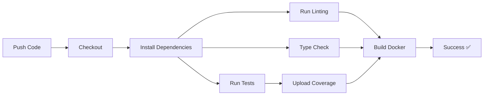
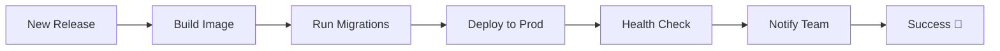

# 🚀 GitHub Actions Workflows

This document explains all the automated workflows configured for this project.

---

## 📋 Table of Contents

- [Workflows Overview](#workflows-overview)
- [Setup Instructions](#setup-instructions)
- [Workflow Details](#workflow-details)
- [Required Secrets](#required-secrets)
- [Deployment Platforms](#deployment-platforms)

---

## 🔄 Workflows Overview

### 1. **Backend CI** (`backend-ci.yml`)
**Triggers**: Push or PR to `main`/`develop` (backend changes only)

**What it does**:
- ✅ Runs unit tests with PostgreSQL + Redis
- ✅ Code linting (Ruff)
- ✅ Type checking (mypy)
- ✅ Code formatting check (Black)
- ✅ Security checks (Safety)
- ✅ Builds Docker image
- ✅ Uploads coverage reports to Codecov

**Status Badge**:
```markdown

```

---

### 2. **Docker Build & Push** (`docker-build.yml`)
**Triggers**: Push to `main`, new tags, or manual trigger

**What it does**:
- 🐳 Builds optimized Docker images
- 📦 Pushes to GitHub Container Registry (ghcr.io)
- 🏷️ Tags images with version/SHA/branch
- 💾 Caches layers for faster builds
- 🌍 Multi-platform build (amd64, arm64)

**Images**:
- `ghcr.io/jellyfishing2346/ai-powered-resume-analyzer-backend:latest`
- `ghcr.io/jellyfishing2346/ai-powered-resume-analyzer-backend:v1.0.0`
- `ghcr.io/jellyfishing2346/ai-powered-resume-analyzer-backend:main-abc123`

---

### 3. **Deploy to Staging** (`deploy-staging.yml`)
**Triggers**: Push to `develop` or manual trigger

**What it does**:
- 🚀 Builds and pushes staging image
- 🌐 Deploys to staging environment
- 📝 Creates deployment summary

**Configure for your platform** (uncomment in the file):
- Railway
- Render
- Fly.io
- DigitalOcean

---

### 4. **Deploy to Production** (`deploy-production.yml`)
**Triggers**: Release published or manual trigger

**What it does**:
- 🎯 Builds production-ready image
- 🗄️ Runs database migrations
- 🚀 Deploys to production
- 📢 Sends deployment notifications

---

### 5. **Security Scan** (`security-scan.yml`)
**Triggers**: Push, PR, weekly schedule (Monday 9 AM), or manual

**What it does**:
- 🔒 Dependency vulnerability scanning (Safety, pip-audit)
- 🔍 Code security analysis (Bandit)
- 🔑 Secret scanning (TruffleHog)
- 🐳 Docker image scanning (Trivy)
- 📊 Uploads results to GitHub Security

---

### 6. **Generate Changelog** (`changelog.yml`)
**Triggers**: New release or manual trigger

**What it does**:
- 📝 Auto-generates CHANGELOG.md
- 📌 Commits and pushes changelog
- 🏷️ Updates for each release

---

## ⚙️ Setup Instructions

### Step 1: Enable GitHub Actions

GitHub Actions are automatically enabled for public repositories. For private repos:
1. Go to **Settings** → **Actions** → **General**
2. Enable **Allow all actions**

### Step 2: Configure Secrets

Add these secrets in **Settings** → **Secrets and variables** → **Actions**:

#### **Required Secrets**

| Secret | Description | How to get |
|--------|-------------|------------|
| `OPENAI_API_KEY` | OpenAI API key for tests | https://platform.openai.com/api-keys |

#### **Optional Deployment Secrets**

| Secret | Description | Platform |
|--------|-------------|----------|
| `RAILWAY_TOKEN` | Railway deployment token | Railway → Settings → Tokens |
| `RENDER_DEPLOY_HOOK_URL` | Render deploy hook | Render → Settings → Deploy Hook |
| `FLY_API_TOKEN` | Fly.io API token | `flyctl auth token` |
| `DIGITALOCEAN_ACCESS_TOKEN` | DigitalOcean token | DO → API → Tokens |
| `PRODUCTION_DEPLOY_HOOK_URL` | Production deploy webhook | Your platform |
| `PRODUCTION_DATABASE_URL` | Production database URL | Your database |

### Step 3: Enable GitHub Container Registry

1. Go to **Settings** → **Packages**
2. Ensure **Improve container support** is enabled
3. Package visibility is set appropriately

### Step 4: Configure Environments (Optional)

For staging/production deployments:

1. Go to **Settings** → **Environments**
2. Create environments: `staging`, `production`
3. Add environment-specific secrets
4. Configure protection rules (e.g., required reviewers for production)

---

## 📊 Workflow Details

### Backend CI Pipeline



### Deployment Pipeline



---

## 🔐 Required Secrets

### OpenAI API Key (Required for tests)

Add this secret for AI features to work in CI:

```bash
# Get your key from: https://platform.openai.com/api-keys
Secret name: OPENAI_API_KEY
Value: sk-your-actual-key-here
```

### Adding Secrets via GitHub UI

1. Go to your repository
2. Click **Settings** → **Secrets and variables** → **Actions**
3. Click **New repository secret**
4. Enter name and value
5. Click **Add secret**

### Adding Secrets via GitHub CLI

```bash
# Install GitHub CLI
brew install gh

# Login
gh auth login

# Add secret
gh secret set OPENAI_API_KEY
# (paste your key when prompted)
```

---

## 🚀 Deployment Platforms

### Railway Deployment

1. **Create Railway project**: https://railway.app
2. **Get API token**: Railway → Settings → Tokens
3. **Add secret**: `RAILWAY_TOKEN`
4. **Uncomment** Railway section in `deploy-staging.yml`

### Render Deployment

1. **Create Render service**: https://render.com
2. **Get deploy hook**: Service → Settings → Deploy Hook
3. **Add secret**: `RENDER_DEPLOY_HOOK_URL`
4. **Uncomment** Render section in `deploy-staging.yml`

### Fly.io Deployment

1. **Install flyctl**: `brew install flyctl`
2. **Create app**: `flyctl launch`
3. **Get token**: `flyctl auth token`
4. **Add secret**: `FLY_API_TOKEN`
5. **Uncomment** Fly.io section in `deploy-staging.yml`

### DigitalOcean App Platform

1. **Create app**: https://cloud.digitalocean.com/apps
2. **Get API token**: API → Tokens
3. **Add secret**: `DIGITALOCEAN_ACCESS_TOKEN`
4. **Uncomment** DigitalOcean section in `deploy-staging.yml`

---

## 📈 Monitoring Workflows

### View Workflow Runs

```
https://github.com/jellyfishing2346/AI-Powered-Resume-Analyzer/actions
```

### Status Badges

Add these to your README.md:

```markdown


```

### Manual Triggers

Run workflows manually:

```bash
# Via GitHub CLI
gh workflow run backend-ci.yml
gh workflow run docker-build.yml
gh workflow run deploy-staging.yml

# Or click "Run workflow" in GitHub Actions UI
```

---

## 🐛 Troubleshooting

### Tests Failing

1. Check if `OPENAI_API_KEY` secret is set
2. Verify PostgreSQL service is running
3. Check test logs for specific errors

### Docker Build Failing

1. Ensure Dockerfile syntax is correct
2. Check if all dependencies are in `pyproject.toml`
3. Verify spaCy model downloads successfully

### Deployment Failing

1. Verify deployment platform credentials
2. Check if environment variables are set
3. Review deployment logs in platform dashboard

### Security Scans Failing

Security scans can fail if vulnerabilities are found. This is intentional!
- Review the scan results
- Update vulnerable dependencies
- Fix security issues before merging

---

## 📝 Best Practices

### Branch Strategy

```
main (production)
  ↑
develop (staging)
  ↑
feature/* (development)
```

### Workflow Triggers

- **feature branches**: Run tests only
- **develop branch**: Run tests + deploy to staging
- **main branch**: Run tests + deploy to production
- **releases**: Create changelog + deploy

### Deployment Safety

1. ✅ Always test on staging first
2. ✅ Use environment protection rules
3. ✅ Require approvals for production
4. ✅ Monitor after deployment
5. ✅ Have rollback plan ready

---

## 🎉 Success Indicators

When everything is working correctly:

- ✅ All checks pass on PRs
- ✅ Docker images build successfully
- ✅ Security scans pass (or issues are addressed)
- ✅ Deployments succeed automatically
- ✅ Coverage reports upload to Codecov

---

## 📚 Additional Resources

- [GitHub Actions Docs](https://docs.github.com/en/actions)
- [Docker Build Push Action](https://github.com/docker/build-push-action)
- [Setup Python Action](https://github.com/actions/setup-python)
- [GitHub Container Registry](https://docs.github.com/en/packages/working-with-a-github-packages-registry/working-with-the-container-registry)

---

**Questions?** Check the [GitHub Discussions](https://github.com/jellyfishing2346/AI-Powered-Resume-Analyzer/discussions) or open an issue!
